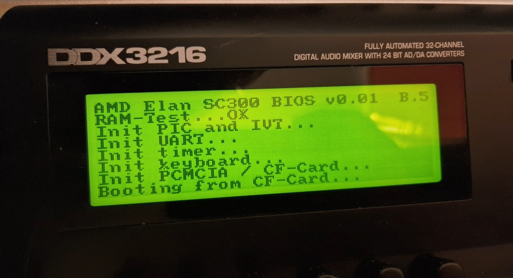
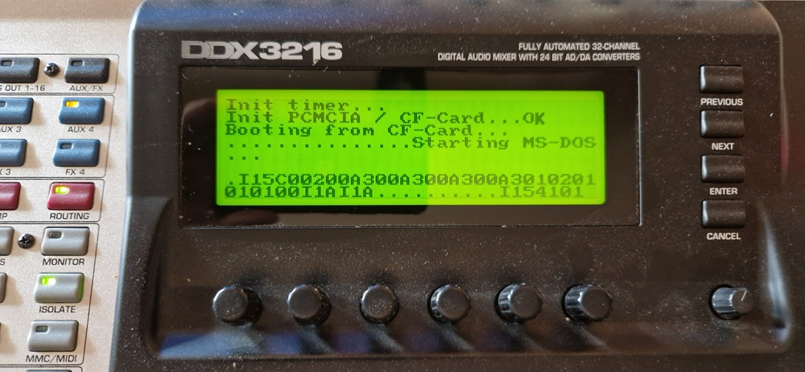
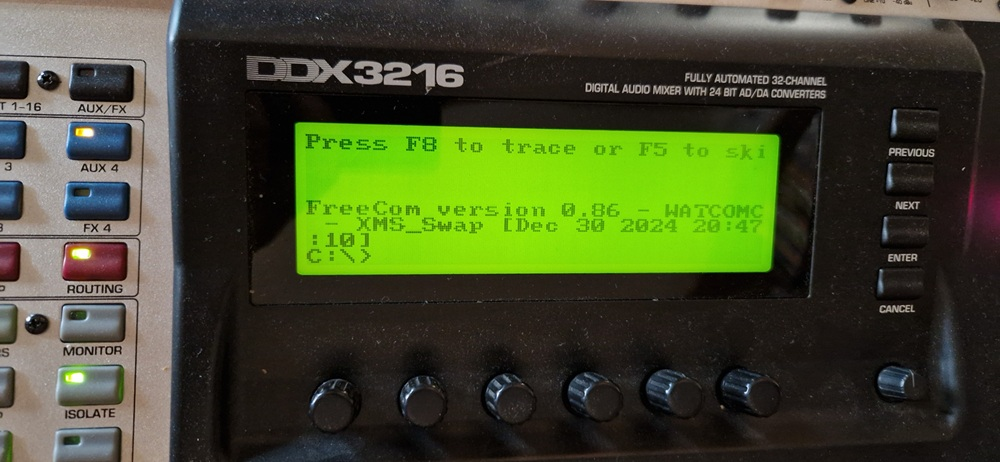

# x86 BIOS for AMD Elan SC300 for the Behringer DDX3216
## General Information

I'm a huge fan of retro-computer and audio-technology. As I learned that the Behringer DDX3216 was built based on an x86-processor some of my neurons fired in my head and I pondered if I could boot software on this device. The DDX3216 uses the following hardware-components:

* AMD Elan SC300 386 Processor (an 386SX SoC with UART, PCMCIA, etc.)
* 27C512 64x8bit ROM IC (for BIOS)
* 8x HYB5117400BJ60 4Mx4bit RAM for total of 16MB DRAM
* 1x UM61256 SRAM (as Video-RAM)
* 4x 29C040-120 Flash-ICs for the main-software
* 4-bit LCD on SC300-internal LCD-interface (with 3x Toshiba T6A39 Col- and 1x T6A40 Row-Controller)
* TLC16C552 external UART (2 Serial-ports and 1x parallel port)
* PCMCIA-Connector for external CF-card-connection (with adapter)
* unassembled Intel 82078 FDC (Floppy Disk Controller) connected to a spare 34-pin connector

On my search for a working BIOS I learned that there is no free BIOS available for the AMD Elan SC300. I even requested an official quote at Phoenix and other manufacturers, but it seems that the SC400 and SC500 are more common as the SC300 is more than 33 years old.

So I started reading x86-documentation and the Programmers Reference Manual of the SC300 and started a new repo. Within only two weeks I managed to get the main-skeleton of a DOS-compatible x86-BIOS, that initializes the basic registers of the SC300, implements the most important hardware- and software-interrupts for the hardware and DOS. It also implements functions for reading the ROM, the CF-card on the PCMCIA-slot and other components like the external UART.

This is a screenshot of the boot-process:

These things are already working:
* [x] Assembler-part that initializes the CPU and the most important parts like DRAM and SRAM
* [x] external UART to communicate with a PC via RS232-cable
* [x] LCD-display via the 4-bit LCD-interface of the SC300 (textmode and CGA graphics-mode)
* [x] CF-card-interface to load the (boot-)sector
* [x] helper-functions for managing textmode and some "higher-levelish" graphics-functions
* [x] booting into shell of FreeDOS 1.4 (other OS might work as well)
* [ ] MS-DOS 6.22 loads IO.SYS and MSDOS.SYS but crashes on loading sectors at the end of the conv. RAM

MS-DOS 6.22 shows "Starting MS-DOS..." but then the system stopps loading:

As MS-DOS still has trouble to boot, I tested FreeDOS in the meantime in version 1.4. And this OS is booting straight to the shell - YEAH!

So I'm able to create my own x86-based system from scratch with own BIOS and own bootsector-code - how cool is this? :-D

## Compiler-switches
I decided to code my BIOS with as much C-code as I can. I'm aware that this is not the most efficient way on programming a BIOS, but I like C compared with smaller portions of (inline-)Assembly as I'm not a good Assembly-programmer. So I tried to tweak GCC in such a way, that the Compiler and Linker produces valid binaries that the x86 is accepting.

But GCC has lot of pitfalls that bit me during programming. Here are the reasons for some of the compiler-switches for GCC:

* -march=i386: let GCC create code that is compatible to the 386 and don't use more modern instructions
* -m16: generate code for a 16-bit environment. GCC outputs .code16gcc assembly
* -O0: don't optimize the code (system wont start with optimizations at all!)
* -ffreestanding: directs the compiler to not assume that standard functions have their usual definition
* -fno-toplevel-reorder: output variables in the same order that they appear in the input file
* -fno-stack-protector: disable stack-protector checks
* -fno-omit-frame-pointer: don't remove the base-pointer BP as it is crucially necessary for RealMode
* -fno-jump-tables: switch-case-elements will not use jump-tables which will fail when using segments
* -mpreferred-stack-boundary=2: reduce stack requirements of the routines as it aligns to 2 bytes
* -mno-80387: don't use the mathematical co-processor-instructions
* -nostdlib: don't use standard-library to save space
* -fno-pic and -fno-pie: don't use Global Offset Tables that doesn't exist in realmode

## Bootsectors
For the first tests I've implemented a very basic Bootsector that implements a very simple and short assembler-part that calls a C-function. Within C the external UART is used to output some demo-text. Actually there are two versions: a very simple bootdisk that stays in real-mode and a more advanced one that enables the protected mode that allows use to use the flat-memory-model of the 386-CPU.
But as I'm close to boot DOS 6.22 on this machine I will not work on these bootdisks anymore.

## Download x86-GCC-Compiler and -assembler:
The main-compiler is GCC i686 with integrated elf-tools in version 7.1.0:
* https://github.com/lordmilko/i686-elf-tools/releases/tag/7.1.0

For the tiny8086 BASIC-interpreter I'm using NASM in version 2.16:
* https://www.nasm.us https://www.nasm.us/pub/nasm/releasebuilds/2.16
tinyBASIC will not run correctly with version 3.0 and newer

Here some documentation for NASM:
* https://www.nasm.us/docs/3.01/nasm09.html#section-9.1
* https://www.nasm.us/doc/nasm08.html

## Comparable projects
If you are planning programming a BIOS by yourself, please consider other and better projects for this. Here are a couple of nice DIY-implementations, that could be helpful:

* https://github.com/maniekx86/M8SBC-486
* https://github.com/640-KB/GLaBIOS
* https://github.com/raszpl/Zenith_ZBIOS/

## Credits
Thanks a lot to rasz_pl of vogons.org, who took some time on looking through the code and suggesting some very helpful things in the forum: https://www.vogons.org/viewtopic.php?t=111450